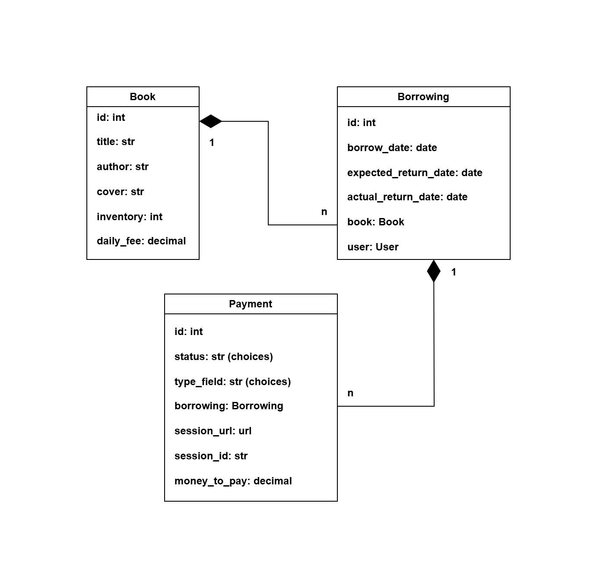
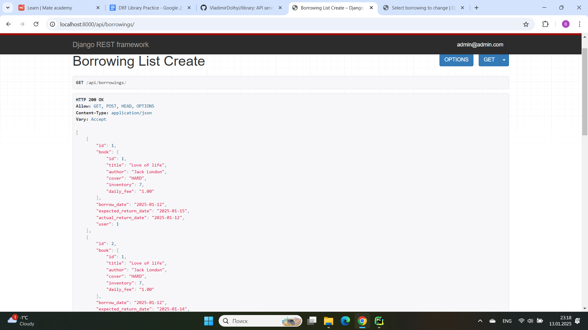

# Library Service

### 👉 Description

API service for library management written on DRF.  
Project for managing local library with books, borrowings and payments

### 👉 Tasks:
##### 1) Implement the CRUD functionality for the Books Service

* Initialize the books app
* Add the book model
* Implement the serializer & views for all the endpoints

##### 2) Implement CRUD for the Users Service

* Initialize the users app
* Add the user model with email
* Add JWT support
* For a better experience during working with the `ModHeader` Chrome extension,
change the default `Authorization` header for JWT authentication to `Authorize`,
for example. Take a look at the docs on how to deal with it.
* Implement the serializer & views for all the endpoints

##### 3) Add permissions to the Books Service

* Only admin users can create/update/delete books
* All users (even unauthenticated ones) should be able to list books
* Use JWT token authentication from the users service

##### 4) Implement the Borrowing List & Detail endpoint

* Initialize the borrowings app
* Add the borrowing model with constraints for borrow_date, expected_return_date,
and actual_return_date.
* Implement a read serializer with detailed book info
* Implement the list & detail endpoints

##### 5) Implement the Create Borrowing endpoint

* Implement create a serializer
* Validate book inventory is not 0
* Decrease inventory by 1 for book
* Attach the current user to the borrowing
* Implement and create an endpoint

##### 6) Add filtering for the Borrowings List endpoint

* Make sure each non-admin can see only their own borrowings
* Make sure borrowings are available only for authenticated users
* Add the `is_active` parameter for filtering by active borrowings (not returned yet)
* Add the `user_id` parameter for admin users, so admin can see all users’ borrowings,
if not specified, but if specified - only for concrete user

##### 7) Implement a return Borrowing functionality

* Make sure you can’t return a borrowing twice
* Add 1 to book inventory on returning
* Add an endpoint for it

##### 8) List & Detail Payments Endpoint

* This task is just an easy one to start working on the interesting process of payments in the system
* Create the Payment model
* Create the serializer & views for list and detail endpoints
* Make sure non-admins can see only their own Payments while admins can see all of them


### 👉 Installing using GitHub

Python3 must be already installed

### ✨ How to use it

> Download the code 

```bash
$ # Get the code
$ git clone https://github.com/VladimirDolhyi/library.git
$ cd library_api
```

#### 👉 Set Up

> Install modules via `VENV`  

```bash
$ python -m venv venv
$ source venv/bin/activate (on macOS)
$ venv\Scripts\activate (on Windows)
$ pip install -r requirements.txt
```

> Set Up Database

```bash
$ python manage.py makemigrations
$ python manage.py migrate
```
> Run the server

```bash
$ python manage.py runserver
```

### 👉 Getting access

* create user via /api/users
* get access token via /api/users/token

### 👉 Features

* JWT authenticated
* Admin panel /admin/
* Documentation is located at /api/doc/swagger/
* Managing books, borrowings and payments
* Creating borrowings with books
* Creating payments with borrowings
* Filtering borrowings


### 👉 Database Schema


### 👉 Endpoints Example


### 👉 Borrowings Page Example

